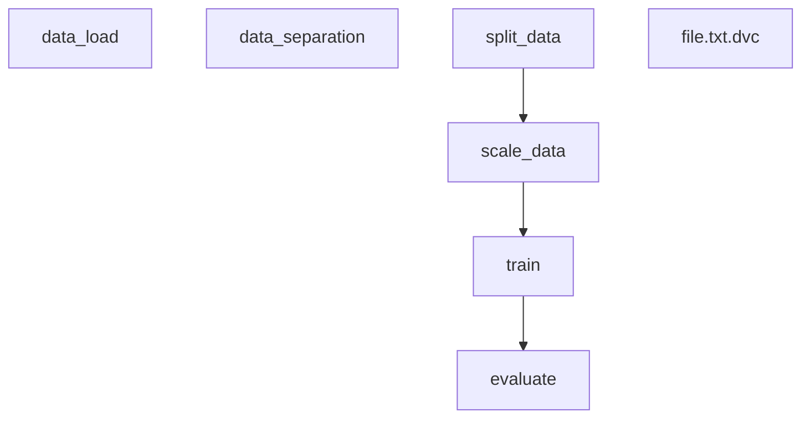

```mermaid
flowchart TD
	node1["data_load"]
	node2["data_separation"]
	node3["evaluate"]
	node4["scale_data"]
	node5["split_data"]
	node6["train"]
	node4-->node6
	node5-->node4
	node6-->node3
	node7["file.txt.dvc"]
```